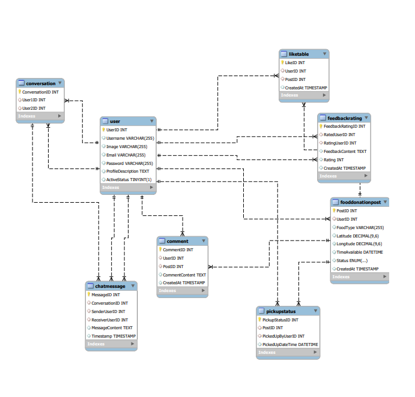

**Edit a file, create a new file, and clone from Bitbucket in under 2 minutes**

 **Project name:- "KindnessKettle"**buhbguy
 
Description:- 
		"KindnessKettle" is a heartwarming platform where generosity meets simplicity.
		It's your go-to space for connecting through food donations. Picture it as a virtual kettle,
		simmering with the warmth of shared kindness. Users effortlessly contribute to the collective
		pot by sharing surplus meals, linking directly with local charities for quick and convenient pickups.
		With KindnessKettle, making a difference is as easy as a shared meal – a simple act that ripples into a sea of goodwill,
		one kettle at a time. Join us in the joy of giving, where every contribution adds to the comforting brew of community care.
		

**Table_Details**
		
		
1. User Table:
   - `UserID` (Primary Key): Unique identifier for each user.
   - `Username`: The username chosen by the user.
   - `image      `: profile of the user.
   - `Email`: Email address of the user.
   - `Password`: Encrypted password for user authentication.
   - `ProfileDescription`: A brief description or bio provided by the user.
   - `ActiveStatus`: Indicates whether the user is currently active or not.
 
2. FoodDonationPost Table:
   - `PostID` (Primary Key): Unique identifier for each food donation post.
   - `UserID` (Foreign Key): References the User table to identify the user who created the post.
   - `FoodType`: Describes the type of food available for donation.
   - `Latitude`	- 
   - `Longitude`- 
   - `TimeAvailable`: Specifies the timeframe during which the food is accessible.
   - `Status`: Indicates whether the post is active or inactive.	
   - `CreatedAt`: Timestamp indicating when the post was created.
 
 
3. Pickupstatus Table:
	  - 'PickupstatusID`:
	  - `PostID`:
	  - `PickedUpByUserID`(Foreign Key, Nullable): References the User table to identify the
		 user who picked up the food items.
	   - `PickedUpDateTime` (Nullable): Timestamp indicating when the food items were picked up.	

 
--------------------------------------------------------------------------------------------------
 
5. Conversation Table:-
    - ConversationID
    - User1ID
    - User2ID
 
6. ChatMessage Table:
   - `MessageID` (Primary Key): Unique identifier for each chat message.
   - `ConversationID` :- ConversationID of each pair.
   - `SenderUserID` (Foreign Key): References the User table to identify the sender of the message.
   - `ReceiverUserID` (Foreign Key): References the User table to identify the receiver of the message.
   - `MessageContent`: The content of the chat message.
   - `Timestamp`: Timestamp indicating when the message was sent.
------------------------------------------------------------------------------------------------------
7. Like Table:
   -  LikeID (Primary Key): Unique identifier for each like.
   -  UserID (Foreign Key): References the User table to identify the user who liked the post.
   -  PostID (Foreign Key): References the FoodDonationPost table to link the like to a specific post.
   -  CreatedAt: Timestamp indicating when the like was made.
 
8. Comment Table:
   - CommentID (Primary Key): Unique identifier for each comment.
   - UserID (Foreign Key): References the User table to identify the user who commented.
   - PostID (Foreign Key): References the FoodDonationPost table to link the comment to a specific post.
   - CommentContent: The content of the comment.
   - CreatedAt: Timestamp indicating when the comment was made.
 
9. FeedbackRating Table:
   - `FeedbackRatingID` (Primary Key): Unique identifier for each feedback and rating.
   - `RatedUserID` (Foreign Key): References the User table to identify the user who is being rated.
   - `RatingUserID` (Foreign Key): References the User table to identify the user providing the rating.
   - `FeedbackContent`: The content of the feedback.
   - `Rating`: Numeric rating provided by the user.
   - `CreatedAt`: Timestamp indicating when the feedback and rating were given.
 

********************************************************************************************************************************************

**Key-Feature**

	One-to-one chat facility 
	user can like on post
	user can comment of post
	forget/reset the password feature
	Real time location sharing facility using google map
	
	
	
********************************************************************************************************************************************

*****************************************************************************************************************************************

**User_Detail table**

CREATE TABLE User_Detail (
    UserID INT IDENTITY(1,1) PRIMARY KEY,
    Username VARCHAR(255),
    Image VARCHAR(255),
    Email VARCHAR(20) UNIQUE,
    Password VARCHAR(20),
    ProfileDescription TEXT,
    ActiveStatus BIT
);

**Food Details**

CREATE TABLE FoodDonationPost (
    PostID INT IDENTITY(1,1) PRIMARY KEY,
    UserID INT,
    FoodType VARCHAR(25),
    Latitude DECIMAL(9, 6),
    Longitude DECIMAL(9, 6),
    TimeAvailable DATETIME,
    Post_Status bit,
    CreatedAt TIMESTAMP,
    FOREIGN KEY (UserID) REFERENCES User_Detail(UserID)
);

**Pickup Details**

CREATE TABLE PickupStatus (
    PickupStatusID INT IDENTITY(1,1) PRIMARY KEY,
    PostID INT,
    PickedUpByUserID INT,
    PickedUpDateTime DATETIME,
    FOREIGN KEY (PostID) REFERENCES FoodDonationPost(PostID),
    FOREIGN KEY (PickedUpByUserID) REFERENCES User_Detail(UserID)
);
 

**Conversation Table**

CREATE TABLE Conversation (
    ConversationID INT IDENTITY(1,1) PRIMARY KEY,
    User1ID INT,
    User2ID INT,
    FOREIGN KEY (User1ID) REFERENCES User_Detail(UserID),
    FOREIGN KEY (User2ID) REFERENCES User_Detail(UserID)
);

**ChatMessage datail**

CREATE TABLE ChatMessage (
    MessageID INT IDENTITY(1,1) PRIMARY KEY,
    ConversationID INT,
    SenderUserID INT,
    ReceiverUserID INT,
    MessageContent TEXT,
    Timestamp TIMESTAMP,
    FOREIGN KEY (ConversationID) REFERENCES Conversation(ConversationID),
    FOREIGN KEY (SenderUserID) REFERENCES User_Detail(UserID),
    FOREIGN KEY (ReceiverUserID) REFERENCES User_Detail(UserID)
);

**Like Table Detail**
CREATE TABLE LikeTable (
    LikeID INT  IDENTITY(1,1) PRIMARY KEY,
    UserID INT,
    PostID INT,
    CreatedAt TIMESTAMP,
    FOREIGN KEY (UserID) REFERENCES User_Detail(UserID),
    FOREIGN KEY (PostID) REFERENCES FoodDonationPost(PostID)
);

**FeedBack Table**
CREATE TABLE Comment (
    CommentID INT IDENTITY(1,1) PRIMARY KEY,
    UserID INT,
    PostID INT,
    CommentContent TEXT,
    CreatedAt TIMESTAMP,
    FOREIGN KEY (UserID) REFERENCES User_Detail(UserID),
    FOREIGN KEY (PostID) REFERENCES FoodDonationPost(PostID)
);

**Feedback Deatils table**
CREATE TABLE FeedbackRating (
    FeedbackRatingID INT IDENTITY(1,1) PRIMARY KEY,
    RatedUserID INT,
    RatingUserID INT,
    FeedbackContent TEXT,
    Rating INT,
    CreatedAt TIMESTAMP,
    FOREIGN KEY (RatedUserID) REFERENCES User_Detail(UserID),
    FOREIGN KEY (RatingUserID) REFERENCES User_Detail(UserID)
);
***************************************************************************************************************************************
**Procedure** 
    **every time user will insert new data using "Insert Query" . Instead of Insert query we give to this task will do our procedure**

CREATE OR ALTER PROCEDURE User_Insert (@Username VARCHAR(255),

									   @Image VARCHAR(255),

									   @Email VARCHAR(255),

									   @Password VARCHAR(255),

									   @ProfileDescription TEXT,

									   @ActiveStatus  bit)

AS

  BEGIN

    INSERT INTO User_Detail(Username,

			 Image,

			 Email, 

			 Password,  

			 ProfileDescription, 

			 ActiveStatus)

            VALUES  ( @Username,

  		      @Image,

  		      @Email,

		      @Password,

		      @ProfileDescription,

		      @ActiveStatus)

        END
 
 
 
 
CREATE OR ALTER PROCEDURE new_Post (@PostID INT,

	@UserID INT,

    @FoodType VARCHAR(255),

    @Latitude DECIMAL(9, 6),

    @Longitude DECIMAL(9, 6),

    @TimeAvailable DATETIME,

    @Post_Status bit,

    @CreatedAt time)

AS

  BEGIN

    INSERT INTO foodDonationPost( PostID,

	UserID,

		 		 FoodType,

				 Latitude, 

				 Longitude,  

				 TimeAvailable, 

				 Post_Status,

				 CreatedAt)

            VALUES( @PostID,

			@UserID,

		   @FoodType,

		   @Latitude,

           @Longitude,

		   @TimeAvailable,

		   @Post_Status,

		   @CreatedAt)

        END;

 **Function**

 CREATE FUNCTION UserProfile (
    @UserID INT
)
RETURNS TABLE
AS
RETURN
    SELECT 
       	Username,
       	Image,
	ProfileDescription,
	ActiveStatus
 
    FROM
        User_Detail
    WHERE
        UserID = @UserID;

**views**
CREATE VIEW UserAnalyticsView AS
SELECT
    u.UserID,
    u.Username,
    u.Email,
    u.ActiveStatus,
    COUNT(DISTINCT fdp.PostID) AS TotalPostsCreated,
    COUNT(DISTINCT c.CommentID) AS TotalCommentsMade,
    COUNT(DISTINCT lt.LikeID) AS TotalLikesGiven,
    AVG(fr.Rating) AS AvgRatingReceived,
    COUNT(DISTINCT fr.FeedbackRatingID) AS TotalFeedbacksReceived,
    COUNT(DISTINCT fr2.FeedbackRatingID) AS TotalRatingsGiven
FROM
    User_Detail u
LEFT JOIN
    FoodDonationPost fdp ON u.UserID = fdp.UserID
LEFT JOIN
    Comment c ON u.UserID = c.UserID
LEFT JOIN
    LikeTable lt ON u.UserID = lt.UserID
LEFT JOIN
    FeedbackRating fr ON u.UserID = fr.RatedUserID
LEFT JOIN
    FeedbackRating fr2 ON u.UserID = fr2.RatingUserID
GROUP BY
    u.UserID, u.Username, u.Email, u.ActiveStatus;

***********************************************************

	

	

	

